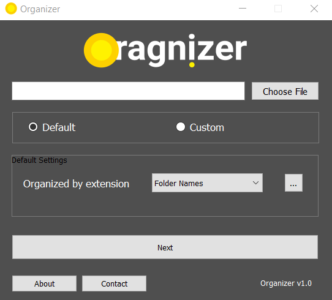
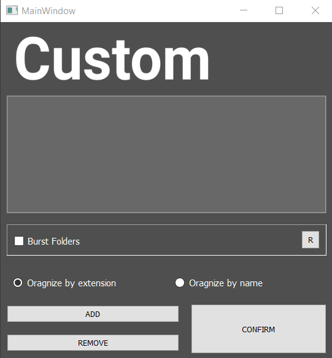
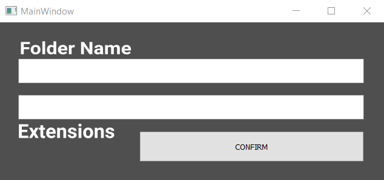

# FileOrganizer
An executable software that sorts files into folders with least of efforts. Moreover it does not require any installation. 

[Click here](http://google.com) to download the zip.

## Steps to use the software
1. Unzip the file named "Organizer.zip"
2. Doubke click "Organier.exe"
3. Click "Choose File" and choose the the folder where the files are to be sorted.

4. Choose "Default" or "Custom" sorting menu as per your need.
	1. Default Menu: It has pre-defined folder names which can be seen the drop down menu "Folder Names". On clicking the "..." button beside the drop down menu prints more details about the default setting in the second screen that popped up when the software was initiated.
	2. Custom Menu: It helps in creating folders and also gives you the freedom to choose what type of file are to get into the folder.
	
	
		1. "Add" button allows you to add folder names and extensions/names that will be used for sorting.
		
		
		
		
		
		Click on "Confirm" to commit changes.
		2. "R" button is the refresh button, it refreshes the board where the added folder names are displayed.
		3. "Remove" button allows to delete a folder entry that was created before. To use this, make sure to refresh the board. Now click on the FolderName, it gets highlighted, and press "Remove". This removes the folder entry. 
		4. If "Burst Folder" is ticked, then it will dissolve any folders contaning withing the target folder, and then start sorting.
		5. As the name suggests "Organize by extension" sorts files into respective folders if the extensions provided matches. And "Organize by name" sorts files into respective folders if the name of the files matches.
		6. Press "Confirm" to begin sorting.
